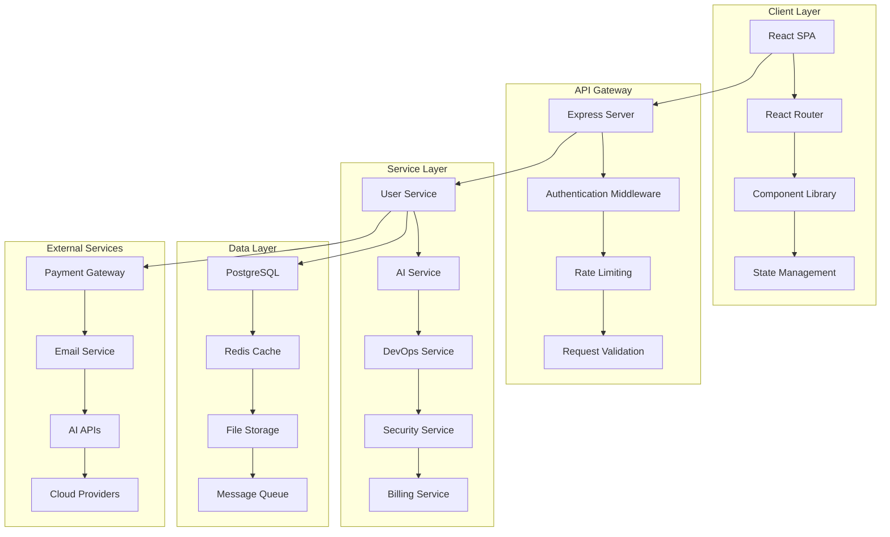
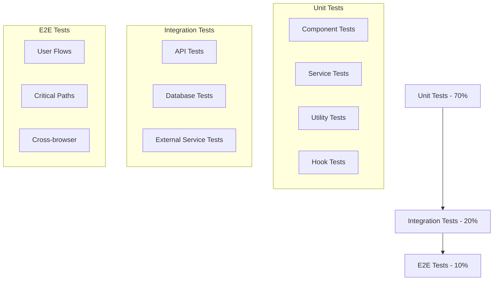

# Design Document

## Overview

The FeexSystems platform enhancement will transform the existing SaaS landing page into a comprehensive, production-ready platform. The design leverages the current React/TypeScript frontend and Express backend while adding robust data persistence, user management, real-time features, and enterprise-grade capabilities. The architecture follows modern microservices principles with clear separation of concerns, scalable data models, and secure authentication flows.

## Architecture

### High-Level Architecture



### Technology Stack Enhancement

**Frontend (Existing + Enhancements)**
- React 18 with TypeScript (existing)
- Vite build system (existing)
- TanStack Query for server state management (existing)
- React Router for navigation (existing)
- Tailwind CSS + shadcn/ui components (existing)
- **New**: React Hook Form for complex forms
- **New**: Zustand for client state management
- **New**: Socket.io client for real-time features

**Backend (Existing + Enhancements)**
- Express.js with TypeScript (existing)
- **New**: PostgreSQL with Prisma ORM
- **New**: Redis for caching and sessions
- **New**: Socket.io for real-time communication
- **New**: Bull Queue for background jobs
- **New**: JWT authentication with refresh tokens
- **New**: Stripe for payment processing

**Infrastructure**
- **New**: Docker containerization
- **New**: Nginx reverse proxy
- **New**: PM2 for process management
- **New**: Monitoring with Prometheus/Grafana

## Components and Interfaces

### Authentication System

```typescript
interface User {
  id: string;
  email: string;
  firstName: string;
  lastName: string;
  role: UserRole;
  subscription: Subscription;
  createdAt: Date;
  updatedAt: Date;
  emailVerified: boolean;
  lastLoginAt?: Date;
}

interface AuthTokens {
  accessToken: string;
  refreshToken: string;
  expiresIn: number;
}

interface AuthService {
  register(userData: RegisterRequest): Promise<User>;
  login(credentials: LoginRequest): Promise<AuthTokens>;
  refreshToken(token: string): Promise<AuthTokens>;
  verifyEmail(token: string): Promise<boolean>;
  resetPassword(email: string): Promise<void>;
}
```

### AI Services Integration

```typescript
interface AIService {
  id: string;
  name: string;
  description: string;
  category: 'chat' | 'analysis' | 'generation' | 'processing';
  pricing: ServicePricing;
  limits: UsageLimits;
}

interface AIRequest {
  serviceId: string;
  userId: string;
  input: any;
  parameters?: Record<string, any>;
  priority: 'low' | 'normal' | 'high';
}

interface AIResponse {
  id: string;
  result: any;
  metadata: {
    processingTime: number;
    tokensUsed: number;
    citations: string[];
    confidence?: number;
  };
  status: 'completed' | 'failed' | 'processing';
}
```

### DevOps Automation

```typescript
interface Repository {
  id: string;
  userId: string;
  provider: 'github' | 'gitlab' | 'bitbucket';
  repoUrl: string;
  branch: string;
  accessToken: string;
  webhookUrl?: string;
}

interface Pipeline {
  id: string;
  repositoryId: string;
  name: string;
  stages: PipelineStage[];
  triggers: PipelineTrigger[];
  environment: Record<string, string>;
  status: 'active' | 'paused' | 'disabled';
}

interface Deployment {
  id: string;
  pipelineId: string;
  commit: string;
  status: 'pending' | 'running' | 'success' | 'failed';
  logs: DeploymentLog[];
  startedAt: Date;
  completedAt?: Date;
}
```

### Security Scanning

```typescript
interface SecurityScan {
  id: string;
  userId: string;
  target: ScanTarget;
  scanType: 'vulnerability' | 'penetration' | 'compliance';
  status: 'queued' | 'running' | 'completed' | 'failed';
  results?: ScanResults;
  scheduledAt?: Date;
  completedAt?: Date;
}

interface Vulnerability {
  id: string;
  severity: 'critical' | 'high' | 'medium' | 'low' | 'info';
  title: string;
  description: string;
  cve?: string;
  remediation: string;
  affectedComponents: string[];
}

interface ScanResults {
  summary: {
    totalVulnerabilities: number;
    criticalCount: number;
    highCount: number;
    mediumCount: number;
    lowCount: number;
  };
  vulnerabilities: Vulnerability[];
  recommendations: string[];
}
```

### Subscription and Billing

```typescript
interface Subscription {
  id: string;
  userId: string;
  planId: string;
  status: 'active' | 'canceled' | 'past_due' | 'unpaid';
  currentPeriodStart: Date;
  currentPeriodEnd: Date;
  cancelAtPeriodEnd: boolean;
  stripeSubscriptionId: string;
}

interface UsageMetrics {
  userId: string;
  period: string;
  aiRequestsCount: number;
  deploymentCount: number;
  securityScansCount: number;
  storageUsed: number;
  bandwidthUsed: number;
}

interface BillingService {
  createSubscription(userId: string, planId: string): Promise<Subscription>;
  updateSubscription(subscriptionId: string, planId: string): Promise<Subscription>;
  cancelSubscription(subscriptionId: string): Promise<void>;
  getUsageMetrics(userId: string, period: string): Promise<UsageMetrics>;
}
```

## Data Models

### Database Schema (PostgreSQL)

```sql
-- Users table
CREATE TABLE users (
  id UUID PRIMARY KEY DEFAULT gen_random_uuid(),
  email VARCHAR(255) UNIQUE NOT NULL,
  password_hash VARCHAR(255) NOT NULL,
  first_name VARCHAR(100) NOT NULL,
  last_name VARCHAR(100) NOT NULL,
  role VARCHAR(20) DEFAULT 'user',
  email_verified BOOLEAN DEFAULT false,
  created_at TIMESTAMP DEFAULT NOW(),
  updated_at TIMESTAMP DEFAULT NOW(),
  last_login_at TIMESTAMP
);

-- Subscriptions table
CREATE TABLE subscriptions (
  id UUID PRIMARY KEY DEFAULT gen_random_uuid(),
  user_id UUID REFERENCES users(id) ON DELETE CASCADE,
  plan_id VARCHAR(50) NOT NULL,
  status VARCHAR(20) NOT NULL,
  current_period_start TIMESTAMP NOT NULL,
  current_period_end TIMESTAMP NOT NULL,
  cancel_at_period_end BOOLEAN DEFAULT false,
  stripe_subscription_id VARCHAR(255) UNIQUE,
  created_at TIMESTAMP DEFAULT NOW(),
  updated_at TIMESTAMP DEFAULT NOW()
);

-- AI Requests table
CREATE TABLE ai_requests (
  id UUID PRIMARY KEY DEFAULT gen_random_uuid(),
  user_id UUID REFERENCES users(id) ON DELETE CASCADE,
  service_id VARCHAR(100) NOT NULL,
  input_data JSONB NOT NULL,
  output_data JSONB,
  metadata JSONB,
  status VARCHAR(20) DEFAULT 'pending',
  processing_time INTEGER,
  tokens_used INTEGER,
  created_at TIMESTAMP DEFAULT NOW(),
  completed_at TIMESTAMP
);

-- Repositories table
CREATE TABLE repositories (
  id UUID PRIMARY KEY DEFAULT gen_random_uuid(),
  user_id UUID REFERENCES users(id) ON DELETE CASCADE,
  provider VARCHAR(20) NOT NULL,
  repo_url VARCHAR(500) NOT NULL,
  branch VARCHAR(100) DEFAULT 'main',
  access_token_encrypted TEXT,
  webhook_url VARCHAR(500),
  created_at TIMESTAMP DEFAULT NOW(),
  updated_at TIMESTAMP DEFAULT NOW()
);

-- Security Scans table
CREATE TABLE security_scans (
  id UUID PRIMARY KEY DEFAULT gen_random_uuid(),
  user_id UUID REFERENCES users(id) ON DELETE CASCADE,
  target_data JSONB NOT NULL,
  scan_type VARCHAR(50) NOT NULL,
  status VARCHAR(20) DEFAULT 'queued',
  results JSONB,
  scheduled_at TIMESTAMP,
  started_at TIMESTAMP,
  completed_at TIMESTAMP,
  created_at TIMESTAMP DEFAULT NOW()
);
```

### Redis Cache Structure

```typescript
// Session storage
interface SessionData {
  userId: string;
  email: string;
  role: string;
  subscriptionStatus: string;
  lastActivity: number;
}

// Rate limiting
interface RateLimitData {
  count: number;
  resetTime: number;
  blocked: boolean;
}

// Cache keys pattern
const CACHE_KEYS = {
  session: (sessionId: string) => `session:${sessionId}`,
  rateLimit: (userId: string, endpoint: string) => `rate_limit:${userId}:${endpoint}`,
  userProfile: (userId: string) => `user:${userId}:profile`,
  aiServiceLimits: (userId: string) => `limits:${userId}:ai`,
  scanResults: (scanId: string) => `scan:${scanId}:results`
};
```

## Error Handling

### Error Classification

```typescript
enum ErrorType {
  VALIDATION_ERROR = 'VALIDATION_ERROR',
  AUTHENTICATION_ERROR = 'AUTHENTICATION_ERROR',
  AUTHORIZATION_ERROR = 'AUTHORIZATION_ERROR',
  RATE_LIMIT_ERROR = 'RATE_LIMIT_ERROR',
  SERVICE_UNAVAILABLE = 'SERVICE_UNAVAILABLE',
  PAYMENT_ERROR = 'PAYMENT_ERROR',
  EXTERNAL_API_ERROR = 'EXTERNAL_API_ERROR',
  INTERNAL_SERVER_ERROR = 'INTERNAL_SERVER_ERROR'
}

interface ApiError {
  type: ErrorType;
  message: string;
  code: string;
  details?: Record<string, any>;
  timestamp: string;
  requestId: string;
}
```

### Error Handling Middleware

```typescript
class ErrorHandler {
  static handle(error: Error, req: Request, res: Response, next: NextFunction) {
    const apiError = this.transformError(error);
    
    // Log error for monitoring
    logger.error('API Error', {
      error: apiError,
      request: {
        method: req.method,
        url: req.url,
        userId: req.user?.id,
        ip: req.ip
      }
    });

    // Send appropriate response
    res.status(this.getStatusCode(apiError.type)).json({
      error: apiError,
      success: false
    });
  }

  static transformError(error: Error): ApiError {
    // Transform different error types into standardized format
    if (error instanceof ValidationError) {
      return {
        type: ErrorType.VALIDATION_ERROR,
        message: error.message,
        code: 'VALIDATION_FAILED',
        details: error.details,
        timestamp: new Date().toISOString(),
        requestId: generateRequestId()
      };
    }
    // ... handle other error types
  }
}
```

### Client-Side Error Handling

```typescript
// React Error Boundary
class ErrorBoundary extends Component<Props, State> {
  constructor(props: Props) {
    super(props);
    this.state = { hasError: false, error: null };
  }

  static getDerivedStateFromError(error: Error): State {
    return { hasError: true, error };
  }

  componentDidCatch(error: Error, errorInfo: ErrorInfo) {
    // Log error to monitoring service
    errorReporting.captureException(error, {
      extra: errorInfo,
      user: this.props.user
    });
  }

  render() {
    if (this.state.hasError) {
      return <ErrorFallback error={this.state.error} />;
    }

    return this.props.children;
  }
}

// API Error Handling Hook
function useApiError() {
  const { toast } = useToast();

  const handleError = useCallback((error: ApiError) => {
    switch (error.type) {
      case ErrorType.AUTHENTICATION_ERROR:
        // Redirect to login
        window.location.href = '/login';
        break;
      case ErrorType.RATE_LIMIT_ERROR:
        toast({
          title: "Rate Limit Exceeded",
          description: "Please wait before making more requests",
          variant: "destructive"
        });
        break;
      default:
        toast({
          title: "Error",
          description: error.message,
          variant: "destructive"
        });
    }
  }, [toast]);

  return { handleError };
}
```

## Testing Strategy

### Testing Pyramid



### Frontend Testing

```typescript
// Component Testing with React Testing Library
describe('UserProfile Component', () => {
  it('should display user information correctly', async () => {
    const mockUser = {
      id: '1',
      email: 'test@example.com',
      firstName: 'John',
      lastName: 'Doe'
    };

    render(<UserProfile user={mockUser} />);
    
    expect(screen.getByText('John Doe')).toBeInTheDocument();
    expect(screen.getByText('test@example.com')).toBeInTheDocument();
  });

  it('should handle profile update', async () => {
    const mockUpdateUser = jest.fn();
    render(<UserProfile user={mockUser} onUpdate={mockUpdateUser} />);
    
    const editButton = screen.getByRole('button', { name: /edit/i });
    fireEvent.click(editButton);
    
    const nameInput = screen.getByLabelText(/first name/i);
    fireEvent.change(nameInput, { target: { value: 'Jane' } });
    
    const saveButton = screen.getByRole('button', { name: /save/i });
    fireEvent.click(saveButton);
    
    await waitFor(() => {
      expect(mockUpdateUser).toHaveBeenCalledWith({
        ...mockUser,
        firstName: 'Jane'
      });
    });
  });
});

// Custom Hook Testing
describe('useAuth Hook', () => {
  it('should handle login flow', async () => {
    const { result } = renderHook(() => useAuth());
    
    act(() => {
      result.current.login('test@example.com', 'password');
    });
    
    await waitFor(() => {
      expect(result.current.isAuthenticated).toBe(true);
      expect(result.current.user).toBeDefined();
    });
  });
});
```

### Backend Testing

```typescript
// API Integration Tests
describe('User API', () => {
  beforeEach(async () => {
    await setupTestDatabase();
  });

  afterEach(async () => {
    await cleanupTestDatabase();
  });

  describe('POST /api/users/register', () => {
    it('should create a new user', async () => {
      const userData = {
        email: 'test@example.com',
        password: 'securePassword123',
        firstName: 'John',
        lastName: 'Doe'
      };

      const response = await request(app)
        .post('/api/users/register')
        .send(userData)
        .expect(201);

      expect(response.body.user.email).toBe(userData.email);
      expect(response.body.user.password).toBeUndefined();
      expect(response.body.tokens).toBeDefined();
    });

    it('should reject duplicate email', async () => {
      // Create user first
      await createTestUser({ email: 'test@example.com' });

      const response = await request(app)
        .post('/api/users/register')
        .send({
          email: 'test@example.com',
          password: 'password',
          firstName: 'John',
          lastName: 'Doe'
        })
        .expect(400);

      expect(response.body.error.type).toBe('VALIDATION_ERROR');
    });
  });
});

// Service Unit Tests
describe('AIService', () => {
  let aiService: AIService;
  let mockAIProvider: jest.Mocked<AIProvider>;

  beforeEach(() => {
    mockAIProvider = createMockAIProvider();
    aiService = new AIService(mockAIProvider);
  });

  it('should process AI request successfully', async () => {
    const request = {
      serviceId: 'chat-gpt',
      userId: 'user-1',
      input: 'Hello, world!',
      parameters: { temperature: 0.7 }
    };

    mockAIProvider.processRequest.mockResolvedValue({
      result: 'Hello! How can I help you?',
      metadata: { tokensUsed: 15, processingTime: 1200 }
    });

    const response = await aiService.processRequest(request);

    expect(response.result).toBe('Hello! How can I help you?');
    expect(response.metadata.tokensUsed).toBe(15);
    expect(mockAIProvider.processRequest).toHaveBeenCalledWith(request);
  });
});
```

### E2E Testing with Playwright

```typescript
// Critical User Flows
test.describe('User Registration and Onboarding', () => {
  test('should complete full registration flow', async ({ page }) => {
    await page.goto('/register');
    
    // Fill registration form
    await page.fill('[data-testid="email-input"]', 'test@example.com');
    await page.fill('[data-testid="password-input"]', 'securePassword123');
    await page.fill('[data-testid="first-name-input"]', 'John');
    await page.fill('[data-testid="last-name-input"]', 'Doe');
    
    // Submit form
    await page.click('[data-testid="register-button"]');
    
    // Verify email verification page
    await expect(page).toHaveURL('/verify-email');
    await expect(page.locator('[data-testid="verification-message"]')).toContainText('Check your email');
    
    // Simulate email verification (in test environment)
    const verificationToken = await getVerificationToken('test@example.com');
    await page.goto(`/verify-email?token=${verificationToken}`);
    
    // Verify successful login and dashboard access
    await expect(page).toHaveURL('/dashboard');
    await expect(page.locator('[data-testid="welcome-message"]')).toContainText('Welcome, John');
  });
});

test.describe('AI Service Usage', () => {
  test('should process AI request and display results', async ({ page }) => {
    await loginAsTestUser(page);
    await page.goto('/ai-tools');
    
    // Select AI service
    await page.click('[data-testid="chat-service-card"]');
    
    // Enter prompt
    await page.fill('[data-testid="ai-input"]', 'Explain quantum computing');
    await page.click('[data-testid="submit-button"]');
    
    // Wait for response
    await expect(page.locator('[data-testid="ai-response"]')).toBeVisible({ timeout: 30000 });
    await expect(page.locator('[data-testid="ai-response"]')).toContainText('quantum');
    
    // Verify usage tracking
    await page.goto('/dashboard');
    await expect(page.locator('[data-testid="ai-usage-count"]')).toContainText('1');
  });
});
```

This comprehensive design document provides the foundation for transforming your existing FeexSystems platform into a production-ready SaaS application with robust user management, AI services, DevOps tools, security features, and enterprise-grade capabilities.