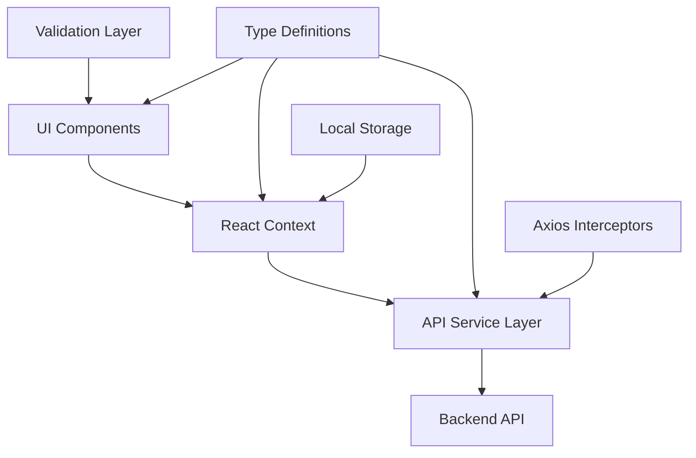

# Design Document

## Overview

The platform enhancement implements a comprehensive authentication system using React, TypeScript, and modern web development practices. The system follows a layered architecture with clear separation of concerns, utilizing React Context for state management, Axios for API communication, and Zod for validation. The design leverages existing infrastructure including Vite for bundling, React Router for navigation, and React Hook Form for form handling.

## Architecture

The authentication system follows a client-server architecture with the following key layers:



### Core Architecture Principles

- **Separation of Concerns**: Clear boundaries between UI, state management, API communication, and validation
- **Type Safety**: Comprehensive TypeScript interfaces and Zod schemas for runtime validation
- **Centralized State**: React Context pattern for global authentication state management
- **Error Handling**: Consistent error handling across all layers with user-friendly messages
- **Security**: Token-based authentication with automatic refresh and secure storage

## Components and Interfaces

### Type System

The authentication system uses a comprehensive type system defined in `src/types/auth.ts`:

- **User Interface**: Defines user profile structure with id, email, name, verification status, and optional profile image
- **AuthState Interface**: Manages authentication state including user, token, loading, and authentication status
- **Credential Interfaces**: Type-safe structures for login, registration, and password reset operations

### Authentication Context

The `AuthContext` provides centralized authentication state management:

- **State Management**: Uses useReducer for predictable state updates
- **Persistence**: Integrates with localStorage for token persistence
- **Initialization**: Automatic authentication check on app startup
- **Methods**: Provides login, register, logout, token refresh, and user update functions

### API Service Layer

The `authAPI` service encapsulates all authentication-related HTTP operations:

- **Axios Configuration**: Pre-configured client with base URL and headers
- **Request Interceptors**: Automatic token attachment to authenticated requests
- **Response Interceptors**: Automatic logout on 401 responses
- **Comprehensive Endpoints**: Support for all authentication flows including profile management

### Validation Layer

Zod-based validation schemas provide both client-side validation and type inference:

- **Login Schema**: Email and password validation
- **Registration Schema**: Complex password requirements with confirmation matching
- **Password Reset Schema**: Secure password reset validation
- **Profile Schema**: User profile update validation

### UI Components

React components built with React Hook Form integration:

- **Form Handling**: Declarative form management with automatic validation
- **Error Display**: Consistent error messaging across all forms
- **Loading States**: User feedback during async operations
- **Navigation Integration**: Seamless routing with protected route support

## Data Models

### User Model
```typescript
interface User {
  id: string;
  email: string;
  name: string;
  isEmailVerified: boolean;
  profileImage?: string;
}
```

### Authentication State Model
```typescript
interface AuthState {
  user: User | null;
  token: string | null;
  isLoading: boolean;
  isAuthenticated: boolean;
}
```

### Credential Models
- **LoginCredentials**: Email and password for authentication
- **RegisterData**: Extended registration data with name and password confirmation
- **Password Reset Data**: Token-based password reset structure

## Error Handling

### Client-Side Error Handling

- **Form Validation Errors**: Real-time validation with field-specific error messages
- **API Error Handling**: Centralized error processing with user-friendly message translation
- **Network Error Handling**: Graceful handling of connectivity issues
- **Authentication Errors**: Automatic logout and redirect on authentication failures

### Error Flow Strategy

1. **Validation Errors**: Caught at form level, displayed inline
2. **API Errors**: Processed by service layer, propagated to UI components
3. **Network Errors**: Handled by Axios interceptors with fallback messaging
4. **Authentication Errors**: Automatic session cleanup and redirect to login

### Error Message Standards

- User-friendly language avoiding technical jargon
- Specific guidance for resolution when possible
- Consistent formatting and placement across all forms
- Security-conscious messaging that doesn't reveal system internals

## Testing Strategy

### Unit Testing Approach

- **Component Testing**: React Testing Library for component behavior verification
- **Service Testing**: Mock API responses for service layer testing
- **Validation Testing**: Comprehensive schema validation testing
- **Context Testing**: Authentication state management testing

### Integration Testing

- **Authentication Flow Testing**: End-to-end authentication scenarios
- **Error Handling Testing**: Error condition simulation and response verification
- **Navigation Testing**: Protected route and redirect behavior testing

### Test Infrastructure

- **Vitest**: Modern testing framework with Vite integration
- **Testing Library**: React component testing utilities
- **Mock Service Worker**: API mocking for integration tests
- **Test Setup**: Centralized test configuration and utilities

### Testing Coverage Areas

1. **Authentication Flows**: Login, registration, logout scenarios
2. **Form Validation**: All validation rules and error conditions
3. **State Management**: Context state transitions and persistence
4. **API Integration**: Service layer functionality and error handling
5. **Component Behavior**: UI component interactions and state updates
6. **Security Features**: Token handling, automatic logout, and session management